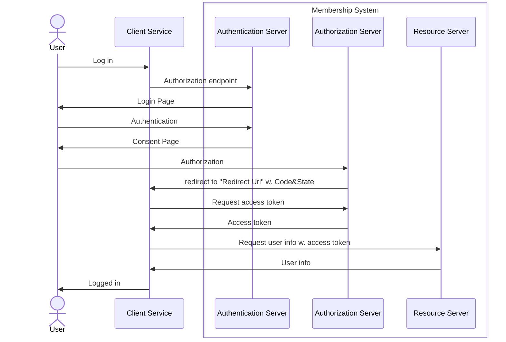

# 會員權限及 SSO 系統

## 架構圖

## 循序圖

### 登入

## TODO

### 會員註冊、認證、授權服務

- 可以透過 API 進行會員註冊和認證
- 實作 JWT 或 OAuth 2.0 作為安全認證，包含 token 過期及刷新機制

### 角色權限控管 (RBAC)

- 實作角色 (role)：admin、moderator、user
- API 訪問應該具有角色限制

### 單點登入服務

- 實作 SSO ，讓使用者登入後可以連登至其他服務
- 實作 SAML 和 OAuth 2.0 等項目，以實現 SSO
- 可以比較其差異
